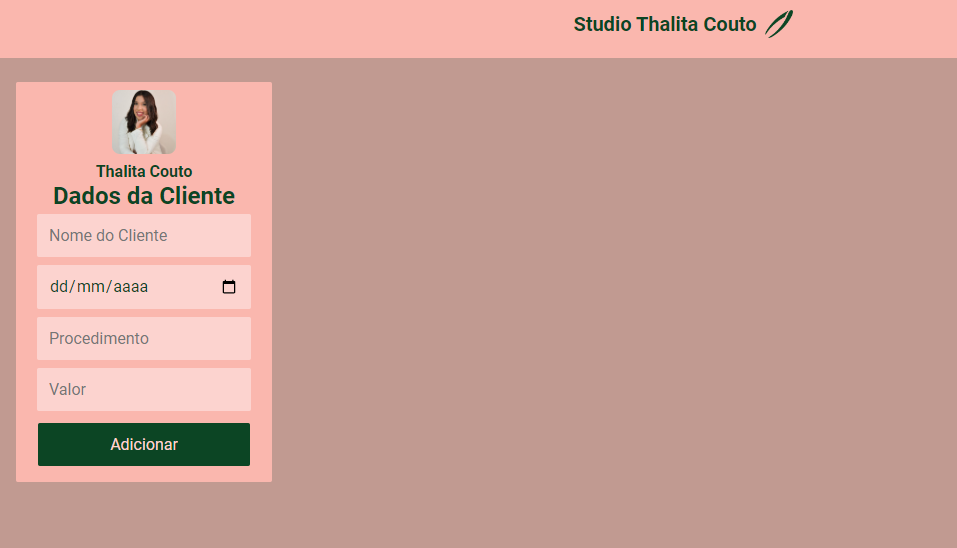
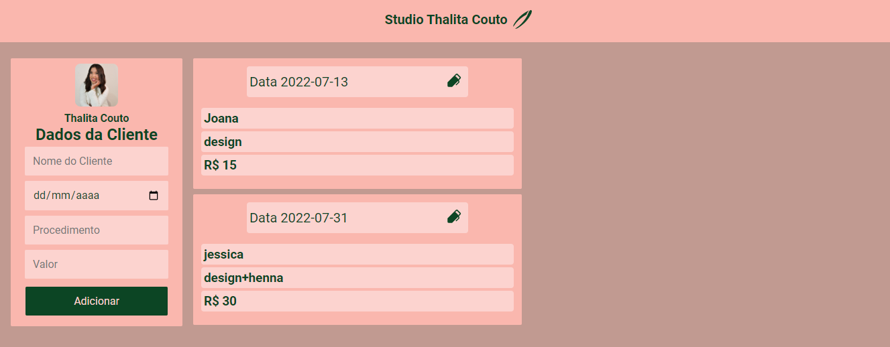
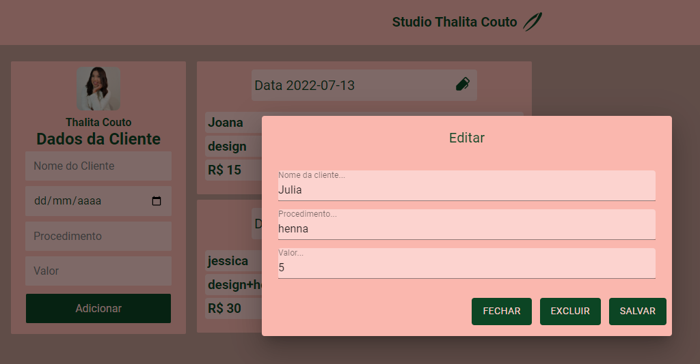
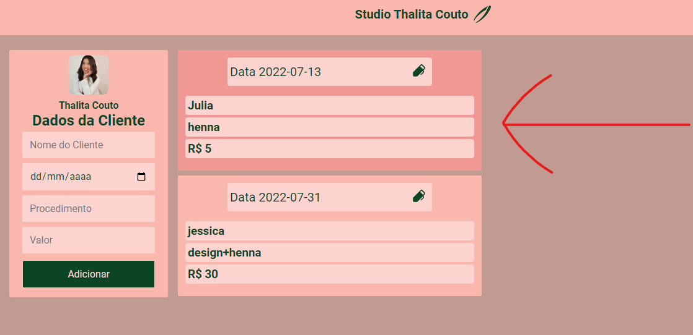

<h3 align="center"> 
	-- Thalita Couto Studio❤️ --
</h3> 

<h1 align="center">
    
</h1>

### 💻 Sobre o projeto

---

- Fiz a aplicação com intuito de ajudar minha esposa no cadastro dos clientes dela.❤️
  

- Um crud simples para que ela possa editar caso erre alguma informação
  

  

## 💻 Projeto

O StudioThalitaCouto é uma aplicação que fiz para minha esposa com a inteção de salvar as clientes que ela atende no formato de Crud simples para ajudar no meu desenvolvimento como desenvolvedor.💜

---

### 🚀 Techs

---

- [Reactjs](https://reactjs.org/)  
- [Node.js](https://nodejs.org/en/)
- [Express](https://expressjs.com/pt-br/)
- [Mysql](https://www.mysql.com/)
- [Axios](https://axios-http.com/ptbr/)
- [Styled-components](https://styled-components.com/)

#### back
- setup da aplicação

#### front
- Componentização
- Propriedades
- Comunicação entre os componentes no reactjs

### 😯 Finalizado 

Feito com ❤️ por John Rodrigues 
👊 [Entre em contato!](https://www.linkedin.com/in/john-r-89643b127/)
